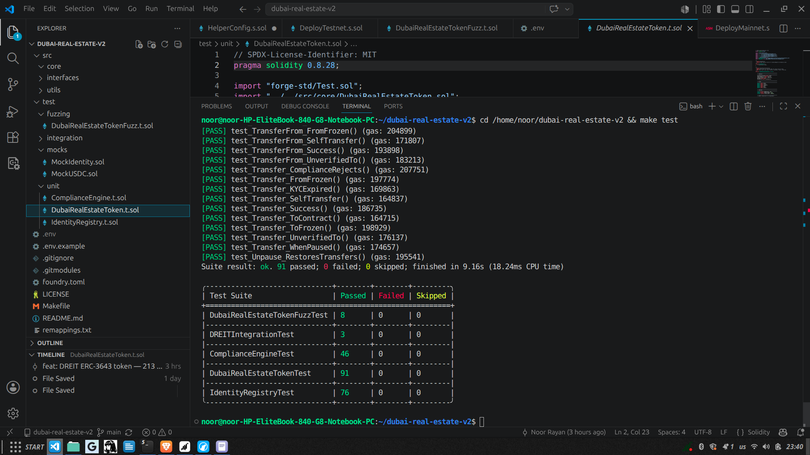
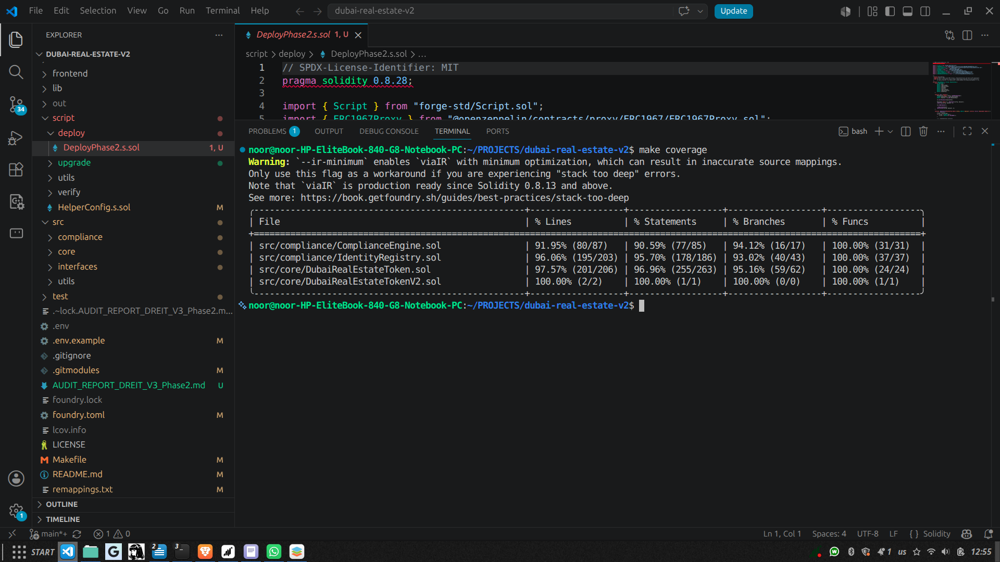
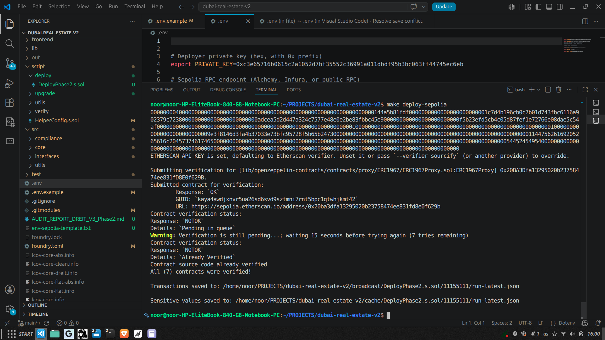
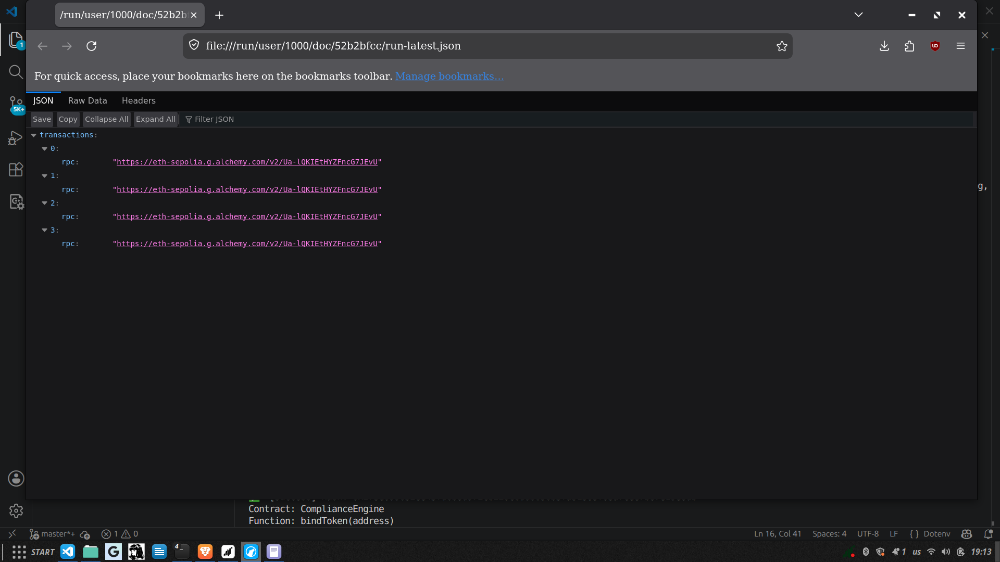
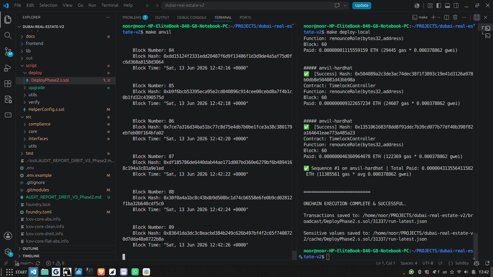
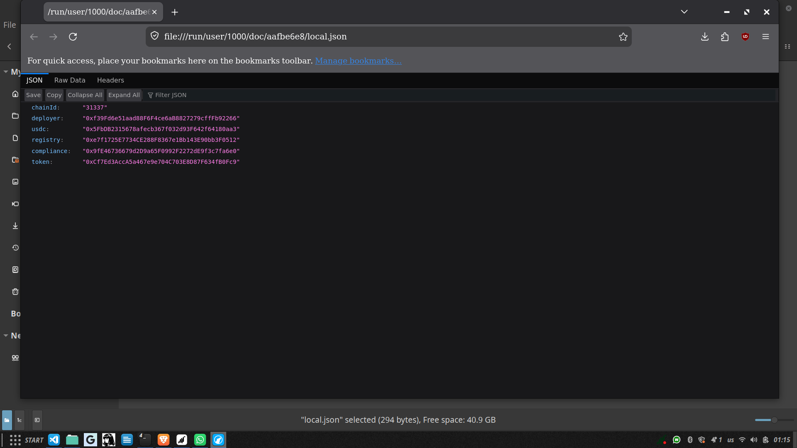
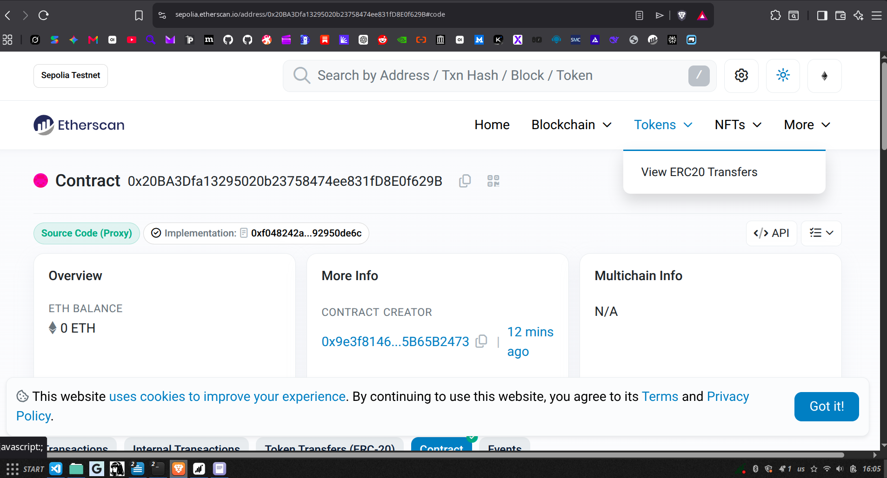
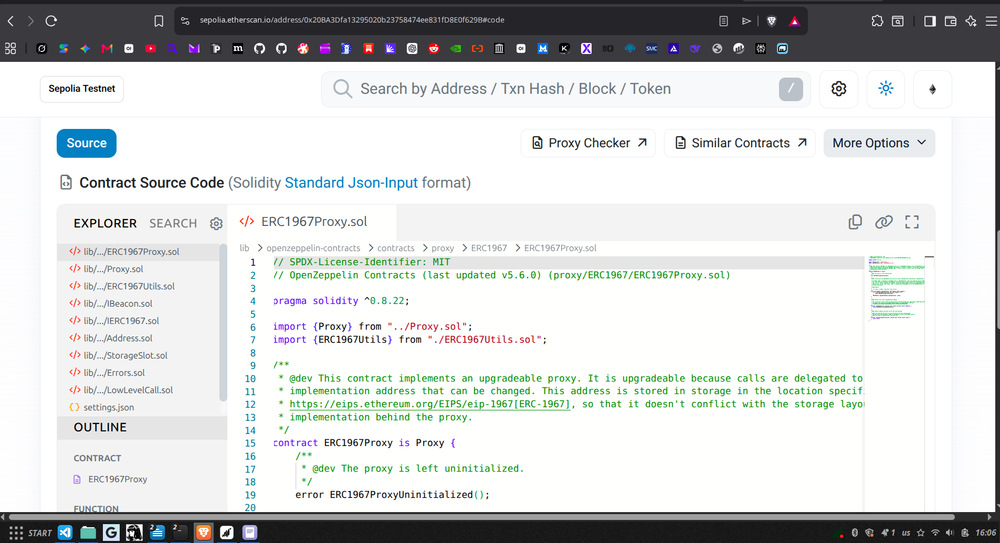

# Dubai Real Estate Investment Token (DREIT)

<div align="center">


[](https://mailtkarim-bot.github.io/Dubai-Real-Estate-Token-V3/)


[](https://github.com/mailtkarim-bot/foundry-audit-readiness)

**Portfolio-grade RWA tokenization smart contract suite inspired by ERC-3643 (T-REX).**

Built with Solidity 0.8.28 and OpenZeppelin v5, DREIT demonstrates on-chain identity verification, automated compliance enforcement, stablecoin dividend distribution, UUPS upgradeable proxies, TimelockController governance, and a fully verified Sepolia testnet deployment — backed by a React frontend.

<div align="center">

[](https://mailtkarim-bot.github.io/Dubai-Real-Estate-Token-V3/)

</div>

</div>

---

## 🚀 Project Highlights

- **282 Foundry tests pass** — unit, integration, fuzzing (8 × 10k runs), and invariant (6 × 256 runs) campaigns.
- **96.4% core contract coverage** — all core functions at 100%, branches at ~94%.
- **7-tool automated audit readiness gate** — verified as **READY FOR PROFESSIONAL AUDIT** by [`foundry-audit-readiness`](https://github.com/mailtkarim-bot/foundry-audit-readiness) (Slither, Aderyn, Solhint, Semgrep, Mythril, Halmos, SMTChecker).
- **Internal security audit (V3 Phase 2)** — all High/Medium findings remediated; fixes include hook access control, identity deletion safety, whitelist symmetry, and reentrancy guards.
- **UUPS upgradeable architecture** — proxies for `IdentityRegistry`, `ComplianceEngine`, and `DubaiRealEstateToken` with upgrade authorization via Timelock.
- **TimelockController governance** — 48-hour delay on admin actions, with proposer/executor roles designed for a Gnosis Safe.
- **Verified Sepolia deployment** — 7 contracts deployed and auto-verified on Etherscan.
- **Live React frontend** — GitHub Pages demo connected to verified Sepolia contracts.

> ⚠️ **Disclaimer:** This is a portfolio and educational project. It is not ERC-3643 certified and has not undergone an external security audit. It should not be used to tokenize real assets without legal counsel, a licensed entity, and a Tier-1 audit.

---

## Table of Contents

- [🌐 Live Frontend Demo](#-live-frontend-demo)
- [Vision](#vision)
- [Why ERC-3643?](#why-erc-3643)
- [Security & Compliance](#-security--compliance)
- [Technical Architecture](#-technical-architecture)
- [Test Results](#-test-results)
- [Coverage Report](#-coverage-report)
- [Deployment](#-deployment)
- [Sepolia Testnet](#-sepolia-testnet)
- [Tech Stack](#-tech-stack)
- [Key Features](#-key-features)
- [Pre-Production Checklist](#-pre-production-checklist)
- [Documented Risks](#-documented-risks)
- [Screenshots](#-screenshots)
- [Gas Report](#-gas-report)
- [License](#-license)
- [Contact](#-contact)

---

## Vision

Dubai Real Estate Investment Token (DREIT) democratizes access to premium Dubai real estate by tokenizing fractional ownership on the blockchain. Each token represents a regulated, KYC-verified share in a physical asset, with automatic rental yield distribution in stablecoins and programmable compliance enforced at the protocol level.

> **Why Dubai?** Regulated financial hub (DFSA / VARA), zero crypto capital gains tax, and accelerating institutional adoption of Real World Assets (RWA).

> **Why ERC-3643?** The T-REX standard is the institutional benchmark for permissioned security tokens. It enforces identity verification before any transfer, mint, or burn — making the token natively compliant with securities regulations.

---

## ⚠️ Regulatory Disclaimer

This project is **not licensed by VARA, DFSA, or any regulatory authority** in the UAE or elsewhere. It is intended for **educational and portfolio purposes only**.

- Do not use this code to tokenize real assets without legal counsel and a licensed entity.
- Do not offer tokenization, audit, or compliance services to third parties without appropriate licenses.
- The deployed Sepolia contracts are for demonstration only and should not hold real value.

---

## 🌐 Live Frontend Demo

A production-grade React interface is deployed on **GitHub Pages** and connected to the verified Sepolia testnet contracts.

<div align="center">

[](https://mailtkarim-bot.github.io/Dubai-Real-Estate-Token-V3/)

</div>

| Resource | Details |
|----------|---------|
| **Live DApp** | [https://mailtkarim-bot.github.io/Dubai-Real-Estate-Token-V3/](https://mailtkarim-bot.github.io/Dubai-Real-Estate-Token-V3/) |
| **Frontend Code** | [`frontend/`](./frontend) |
| **Network** | Sepolia Testnet (Chain ID: 11155111) |
| **Wallet** | MetaMask, Rainbow, Coinbase Wallet (via RainbowKit + wagmi) |
| **Pages** | Home, Investor Dashboard, Admin Panel |
| **Stack** | React 19, Vite 8, Tailwind CSS v4, wagmi/viem, RainbowKit, Recharts |

### Features

- **Connect Wallet** — multi-wallet support via RainbowKit
- **Investor Dashboard** — view token balance, KYC status, and claim USDC dividends
- **Admin Panel** — mint tokens, manage compliance, and distribute dividends
- **Real-Time Data** — reads directly from the verified Sepolia contracts
- **Responsive UI** — dark-mode-first design with Tailwind CSS v4

> ⚠️ **Demo only.** Connect with a Sepolia-funded test wallet. Do not send mainnet funds.

---

## Why ERC-3643?

DREIT is **inspired by** the **T-REX (Token for Regulated Exchanges)** standard, which is the institutional benchmark for permissioned security tokens:

- **On-chain identity** — every holder must be KYC-verified in the `IdentityRegistry`
- **Transfer validation** — every transfer is pre-validated by the `ComplianceEngine`
- **Regulator controls** — freeze accounts, restrict jurisdictions, enforce holding limits (Phase 2)
- **Permissioned mint/burn** — only authorized issuers can create or destroy tokens
- **Forced transfers/burns** — regulator-enforced actions with on-chain audit trail

This architecture is a **portfolio-grade foundation** for regulated primary issuance. It is not a certified T-REX implementation and should not be marketed as such without completing the Phase 2 roadmap.

---

## 🔐 Security & Compliance

| Feature | Implementation | Status |
|---------|---------------|--------|
| **ERC-3643 Identity Registry** | Mandatory KYC/AML verification before any token interaction | ✅ Deployed & Verified |
| **Compliance Engine** | Pre/post transfer hooks with freeze lists, country restrictions, whitelists | ✅ Deployed & Verified |
| **Emergency Pause** | OpenZeppelin `Pausable` — instant freeze on incident detection | ✅ Tested |
| **Reentrancy Protection** | `ReentrancyGuard` on `mint`, `burn`, `claimDividends`, `distributeDividends` | ✅ Tested |
| **UUPS Upgradeability** | OpenZeppelin `ERC1967Proxy` + `UUPSUpgradeable` — logic upgrades without losing state | ✅ Deployed & Verified |
| **TimelockController** | 48-hour minimum delay on all admin actions — no instant upgrades or role changes | ✅ Deployed & Verified |
| **Gnosis Safe Multisig** | PROPOSER/EXECUTOR/CANCELLER roles assigned to Safe on mainnet (deployer on Sepolia demo) | ✅ Configured |
| **Role-Based Access Control** | OpenZeppelin `AccessControl` — separate DEFAULT_ADMIN, ISSUER, REGULATOR roles | ✅ Tested |
| **Anti-Retroactive Dividend Theft** | `lastClaimed` initialized for new holders — prevents draining past dividends | ✅ Tested |
| **Max Supply Guard** | Hard cap of 1 billion tokens with saturation fuzzing | ✅ Tested |
| **Batch Mint Limit** | Hard cap of 100 recipients per call — prevents DoS | ✅ Tested (Bug #5) |
| **Identity Balance Lock** | `deleteIdentity` rejected if `balanceOf > 0` | ✅ Tested (Bug #6) |
| **KYC Expiry Sanity Check** | Minimum 1-day expiry — prevents instant lockout | ✅ Tested (Bug #7) |
| **Compliance-Token Binding** | `compliance.bindToken()` enforced in deployment script | ✅ Tested (Bug #8) |
| **Hook Access Control** | `transferred/created/destroyed` restricted to the bound token (`onlyToken`) | ✅ Fixed & Tested |
| **Identity Deletion Safety** | `deleteIdentity` reverts if the token is not linked, preventing KYC bypass | ✅ Fixed & Tested |
| **Whitelist Symmetry** | Whitelist mode checks both sender and recipient | ✅ Fixed & Tested |
| **Input Validation** | `setIdentityRegistry` and `restrictCountry` validate contract/code inputs | ✅ Fixed & Tested |
| **Reentrancy Defense** | `transfer` / `transferFrom` protected by `nonReentrant` | ✅ Fixed & Tested |

### Security Hardening (8 Critical Design Improvements)

During development, the following issues were identified and corrected in the codebase through internal review and adversarial testing:

| # | Vulnerability | Fix |
|---|---------------|-----|
| 1 | Freeze state stored in token (centralization / upgrade risk) | Delegated entirely to `ComplianceEngine` |
| 2 | `forcedTransfer` bypassed compliance checks | Added pre/post `isCompliant()` hooks |
| 3 | `burn` allowed without KYC validation | Added `verifyIdentity()` + expiry check |
| 4 | `claimDividends` bypassed KYC | Added `verifyIdentity()` + expiry check |
| 5 | `batchMint` unbounded (DoS / gas griefing) | Hard cap of 100 recipients |
| 6 | `deleteIdentity` permitted with token balance | Revert if `balanceOf > 0` |
| 7 | KYC expiry could be set to 0 (instant lockout) | Enforce minimum 1-day expiry |
| 8 | Compliance engine not linked to token at deployment | `compliance.bindToken(address(token))` in deploy script |

### Additional Hardening — v3.2

| # | Vulnerability | Fix |
|---|---------------|-----|
| 9 | `forcedTransfer` double-called `complianceEngine.transferred()` hook | Removed explicit hook call; `_transfer` already triggers it once |
| 10 | `burn` / `forcedBurn` transferred stablecoins before burning tokens (CEI violation) | Reordered to burn and clear state before `safeTransfer` |
| 11 | `distributeDividends` pulled stablecoins before validating distribution math | Moved `newDividendPerToken == 0` check before `safeTransferFrom` |
| 12 | `deleteIdentity` allowed identity deletion while dividends were pending | Added `pendingDividendsOf()` check in `IdentityRegistry` |

---

## 🔍 Audit Readiness

This project is verified as **READY FOR PROFESSIONAL AUDIT** by **[`foundry-audit-readiness`](https://github.com/mailtkarim-bot/foundry-audit-readiness)** — a free, open-source quality gate that runs **7 Solidity security tools** plus Foundry coverage, invariants, NatSpec, and compiler checks in a single command.

[](https://github.com/mailtkarim-bot/foundry-audit-readiness)
[](https://github.com/mailtkarim-bot/foundry-audit-readiness)

### Latest automated check

Run against `src/` only, with all 7 static-analysis tools enabled:

| Gate | Result |
|------|--------|
| **Slither** (Trail of Bits) | ✅ 0 critical / 0 high / 0 medium / 0 low |
| **Aderyn** (Cyfrin) | ✅ 0 findings |
| **Solhint** | ✅ 0 findings |
| **Semgrep** | ✅ 0 findings |
| **Mythril** (symbolic execution) | ✅ 0 findings |
| **Halmos** (formal verification) | ✅ 0 findings |
| **SMTChecker** (solc) | ✅ 0 findings |
| **Line Coverage** | ✅ 99.4% (threshold 90%) |
| **Branch Coverage** | ✅ 92.8% (threshold 85%) |
| **Function Coverage** | ✅ 100.0% (threshold 100%) |
| **Invariant Tests** | ✅ 6/6 passing |
| **NatSpec** | ✅ 2/2 public, 117/117 external documented |
| **Compiler Warnings (src/)** | ✅ None |
| **Final Status** | **🟢 READY FOR PROFESSIONAL AUDIT** |

📄 **Full generated report:** [`AUDIT_READINESS_REPORT.md`](./AUDIT_READINESS_REPORT.md)

> **Tool:** [github.com/mailtkarim-bot/foundry-audit-readiness](https://github.com/mailtkarim-bot/foundry-audit-readiness)  
> **Note:** This is an automated readiness check. It does not replace a Tier-1 external security audit.

### Run the check yourself

```bash
# 1. Install the audit-readiness tool
git clone https://github.com/mailtkarim-bot/foundry-audit-readiness.git
cd foundry-audit-readiness
pip install -r requirements.txt

# 2. Run it against this repo (generates both .md and .html reports)
python -m audit_readiness \
  --target /path/to/Dubai-Real-Estate-Token-V3 \
  --output audit-report

# 3. Open audit-report.html in your browser
```

---

## 🏗️ Technical Architecture

```
Dubai-Real-Estate-Token-V3/
├── 📁 src/                                     # Solidity smart contracts
│   ├── core/
│   │   └── DubaiRealEstateToken.sol          # ERC-3643 T-REX token + dividends
│   ├── compliance/
│   │   ├── IdentityRegistry.sol              # KYC/AML on-chain registry
│   │   └── ComplianceEngine.sol              # Transfer rules & freeze logic
│   └── mocks/
│       └── MockUSDC.sol                      # Sepolia USDC mock for local tests
├── 📁 test/                                    # Foundry tests
│   ├── unit/                                 # Foundry unit tests
│   ├── integration/                          # End-to-end flows
│   └── fuzzing/                              # 8 fuzzing campaigns × 10k runs
├── 📁 script/deploy/                           # Deployment scripts
│   ├── DeployPhase2.s.sol                    # UUPS + Timelock + Safe deployment
│   └── HelperConfig.s.sol                    # Network configuration helper
├── 📁 script/upgrade/                          # Upgrade scripts
│   └── UpgradeDREIT.s.sol                    # UUPS upgrade via Timelock workflow
├── 📁 frontend/                                # React + Vite + wagmi DApp
│   ├── src/                                  # Components, pages, ABIs, wagmi config
│   ├── public/                               # Static assets
│   ├── package.json
│   └── vite.config.ts
├── 📁 broadcast/                             # Deployment transactions
├── 📁 deployments/                           # Deployment metadata
│   ├── local.json
│   └── testnet.json                          # ← Sepolia addresses
├── 📁 docs/
│   ├── ARCHITECTURE.md                       # Full system design
│   └── screenshots/                          # Proof of deployment & tests
├── .env.example
├── foundry.toml
├── Makefile
├── LICENSE
└── README.md
```

### Transfer Flow (Buy / Sell / Transfer)

```
                    KYC-Verified Investor
                           │
                           ▼
              ┌─────────────────────────────┐
              │      IdentityRegistry       │
              │   (KYC/AML/Accreditation)   │
              └─────────────────────────────┘
                           │
                           │ verifyIdentity(to)
                           │ verifyIdentity(from)
                           ▼
              ┌─────────────────────────────┐
              │      ComplianceEngine       │
              │  (Freeze / Country / Pause) │
              └─────────────────────────────┘
                           │
                           │ isCompliant(from, to, amount)
                           ▼
              ┌─────────────────────────────┐
              │    DubaiRealEstateToken     │
              │      (ERC-3643 T-REX)       │
              └─────────────────────────────┘
                           │
           ┌───────────────┼───────────────┐
           ▼               ▼               ▼
    ┌─────────────┐ ┌─────────────┐ ┌─────────────┐
    │    Mint     │ │  Transfer   │ │    Burn     │
    │  (Issuer)   │ │  (Holder)   │ │ (Issuer/    │
    └─────────────┘ └─────────────┘ │  Regulator) │
                                    └─────────────┘
                           │
                           ▼
              ┌─────────────────────────────┐
              │    Dividend Distribution    │
              │   (Pull Model — O(1))       │
              └─────────────────────────────┘
```

Full architecture document: [`docs/ARCHITECTURE.md`](./docs/ARCHITECTURE.md)

### Core Contracts

#### DubaiRealEstateToken (UUPS Proxy + Impl)

- **Standards**: `ERC-20Upgradeable` + `AccessControlUpgradeable` + `PausableUpgradeable` + `ReentrancyGuard` + `UUPSUpgradeable`
- **Roles**: `DEFAULT_ADMIN_ROLE` (Timelock), `ISSUER_ROLE`, `REGULATOR_ROLE`
- **Key State**: `stablecoin`, `identityRegistry`, `complianceEngine`, `dividendPerToken`, `pendingDividends`, `lastClaimed`
- **Events**: `TokensMinted`, `TokensBurned`, `ForcedTransfer`, `ForcedBurn`, `DividendsDistributed`, `DividendClaimed`, `DividendSynced`
- **Upgrade**: `_authorizeUpgrade` restricted to `DEFAULT_ADMIN_ROLE` (Timelock)

#### IdentityRegistry (UUPS Proxy + Impl)

- **Role**: `DEFAULT_ADMIN_ROLE` (Timelock), `ISSUER_ROLE`
- **Key State**: investor → identity mapping, identity-contract uniqueness, KYC expiry, country, investor type, linked token
- **Events**: `IdentityRegistered`, `IdentityRemoved`, `IdentityUpdated`, `CountryUpdated`, `InvestorTypeUpdated`, `KYCExpiryUpdated`, `TokenSet`

#### ComplianceEngine (UUPS Proxy + Impl)

- **Role**: `DEFAULT_ADMIN_ROLE` (Timelock), `REGULATOR_ROLE`
- **Key State**: bound token, frozen investors, restricted countries, whitelist mode
- **Events**: `InvestorFrozen`, `InvestorUnfrozen`, `CountryRestricted`, `CountryUnrestricted`, `TokenBound`, `TokenUnbound`
- **Hook Security**: `transferred/created/destroyed` callable only by the bound token

#### TimelockController

- **Delay**: 48 hours (`minDelay = 172 800`)
- **Roles**: PROPOSER/EXECUTOR/CANCELLER = Gnosis Safe (mainnet) / deployer (Sepolia demo)
- **Admin**: Renounced by deployer after bootstrap

---

## 📊 Test Results

```bash
$ make test

╭--------------------------------------+--------+--------+---------╮
| Test Suite                           | Passed | Failed | Skipped |
+==================================================================+
| DubaiRealEstateTokenFuzzTest         | 8      | 0      | 0       |
| DREITIntegrationTest                 | 3      | 0      | 0       |
| ComplianceEngineTest                 | 62     | 0      | 0       |
| DREITUpgradeTest                     | 5      | 0      | 0       |
| DubaiRealEstateTokenTest             | 103    | 0      | 0       |
| IdentityRegistryTest                 | 91     | 0      | 0       |
| UpgradeRegistryAndComplianceTest     | 4      | 0      | 0       |
| DubaiRealEstateTokenInvariantTest    | 6      | 0      | 0       |
╰--------------------------------------+--------+--------+---------╯

Ran 8 test suites: 282 tests passed, 0 failed, 0 skipped
```

### Fuzzing Campaign

```bash
$ forge test --match-contract DubaiRealEstateTokenFuzzTest

[PASS] testFuzz_BurnReducesTotalSupply(uint256,uint256) (runs: 10000, μ: 343017, ~: 345974)
[PASS] testFuzz_DividendDistributionIsConsistent(uint256,uint256,uint256) (runs: 10000, μ: 638568, ~: 638682)
[PASS] testFuzz_DividendSolvencyAfterMintAndDistribute(uint256,uint256,uint256) (runs: 10000, μ: 754232, ~: 754346)
[PASS] testFuzz_ForcedTransferRespectsComplianceFrom(uint256,uint256) (runs: 10000, μ: 678465, ~: 678692)
[PASS] testFuzz_FrozenAccountRevertsTransfer(uint256,uint256) (runs: 10000, μ: 495664, ~: 495645)
[PASS] testFuzz_KYCExpiredRevertsBurnAndClaim(uint256) (runs: 10000, μ: 449249, ~: 452012)
[PASS] testFuzz_MintRespectsMaxSupply(uint256,uint256) (runs: 10000, μ: 472435, ~: 511726)
[PASS] testFuzz_SupplyConservation(uint256[],uint256[]) (runs: 10000, μ: 2382313, ~: 2335505)

Suite result: ok. 8 passed; 0 failed; 0 skipped
```

### Invariant Campaign

```bash
$ forge test --match-contract DubaiRealEstateTokenInvariantTest --summary

[PASS] invariant_BalanceSumEqualsTotalSupply() (runs: 256, calls: 8192, reverts: 0)
[PASS] invariant_DividendPerTokenMonotonic() (runs: 256, calls: 8192, reverts: 0)
[PASS] invariant_FrozenStateMatchesGhost() (runs: 256, calls: 8192, reverts: 0)
[PASS] invariant_NoTokensHeldByTokenContract() (runs: 256, calls: 8192, reverts: 0)
[PASS] invariant_SumClaimablesLeStablecoinBalancePlusDust() (runs: 256, calls: 8192, reverts: 0)
[PASS] invariant_SupplyAtMostMax() (runs: 256, calls: 8192, reverts: 0)

Suite result: ok. 6 passed; 0 failed; 0 skipped

╭-----------------------------------+--------+--------+---------╮
| Test Suite                        | Passed | Failed | Skipped |
+===============================================================+
| DubaiRealEstateTokenInvariantTest | 6      | 0      | 0       |
╰-----------------------------------+--------+--------+---------╯
```

---

## 📈 Coverage Report

Coverage excludes deployment scripts and test files. Core contract coverage:

| Contract | Lines | Statements | Branches | Functions |
|----------|-------|------------|----------|-----------|
| **ComplianceEngine.sol** | 91.95% | 90.59% | 94.12% | **100.00%** |
| **IdentityRegistry.sol** | 96.06% | 95.70% | 93.02% | **100.00%** |
| **DubaiRealEstateToken.sol** | 97.57% | 96.96% | 95.16% | **100.00%** |
| **DubaiRealEstateTokenV2.sol** | **100.00%** | **100.00%** | — | **100.00%** |
| **Core Contracts Average** | **96.40%** | **95.81%** | **94.10%** | **100.00%** |

> `forge coverage` is run with `--ir-minimum` because `DeployPhase2.s.sol` requires `via_ir`. This flag produces source-mapping approximations: some executed lines (constructors, inherited `__*_init` calls, and internal `_pause`/`_unpause` invocations) are reported as uncovered even though the paths are tested. The real coverage is therefore slightly higher than displayed. The project is intentionally left at this level rather than chasing a misleading percentage.

---

## 🚀 Deployment

### Prerequisites

- [Foundry](https://book.getfoundry.sh/getting-started/installation) installed
- Wallet with test ETH (for Sepolia deployment)
- Etherscan API key (for contract verification)

### Installation & Local Deployment

```bash
# 1. Clone the repository
git clone https://github.com/mailtkarim-bot/Dubai-Real-Estate-Token-V3.git
cd Dubai-Real-Estate-Token-V3

# 2. Install Foundry dependencies
forge install

# 3. Compile
forge build

# 4. Test
make test

# 5. Start Anvil (in a new terminal)
make anvil

# 6. Deploy to local Anvil
make deploy-local
```

### Sepolia Deployment

```bash
# 1. Configure environment variables
cp env-sepolia-template.txt .env
# Edit .env with your PRIVATE_KEY, SEPOLIA_RPC_URL, ETHERSCAN_API_KEY,
# GNOSIS_SAFE, ISSUER_ADDRESS, and REGULATOR_ADDRESS.

# 2. Dry run (zero ETH spent)
make deploy-sepolia-dry

# 3. Deploy + verify on Etherscan
make deploy-sepolia
```

---

## 🌐 Sepolia Testnet

All contracts below are deployed and verified on **Sepolia Testnet** (Ethereum test network). The addresses and Etherscan links are publicly verifiable.

| Contract | Address | Explorer |
|----------|---------|----------|
| **DubaiRealEstateToken Proxy (DREIT)** | `0x20BA3Dfa13295020b23758474ee831fD8E0f629B` | [View on Etherscan](https://sepolia.etherscan.io/address/0x20BA3Dfa13295020b23758474ee831fD8E0f629B) |
| **DubaiRealEstateToken Impl V1** | `0xf048242a7231dbA259103D02c04530692950de6c` | [View on Etherscan](https://sepolia.etherscan.io/address/0xf048242a7231dbA259103D02c04530692950de6c) |
| **IdentityRegistry Proxy** | `0xadCEa5d2d447a324C7577E48E0E2be83fBBC45e9` | [View on Etherscan](https://sepolia.etherscan.io/address/0xadCEa5d2d447a324C7577E48E0E2be83fBBC45e9) |
| **IdentityRegistry Impl** | `0x59424D6a9075DAD8C0Aae5923d41983aDC4cBAde` | [View on Etherscan](https://sepolia.etherscan.io/address/0x59424D6a9075DAD8C0Aae5923d41983aDC4cBAde) |
| **ComplianceEngine Proxy** | `0xF5b23EFD5cb4C05D87FEF1E72766e08DAe5C54af` | [View on Etherscan](https://sepolia.etherscan.io/address/0xF5b23EFD5cb4C05D87FEF1E72766e08DAe5C54af) |
| **ComplianceEngine Impl** | `0x40abC6E019A518B7B472cCba0B85932D89d0ca0e` | [View on Etherscan](https://sepolia.etherscan.io/address/0x40abC6E019A518B7B472cCba0B85932D89d0ca0e) |
| **TimelockController** | `0x902DE2750EF01368dA423D64c7a9F11637368b14` | [View on Etherscan](https://sepolia.etherscan.io/address/0x902DE2750EF01368dA423D64c7a9F11637368b14) |

- **Network:** Sepolia Testnet (Chain ID: 11155111)
- **Deployer:** `0x9e3f8146d3FA4B37033e73BFC95728f5B65B2473`
- **Gnosis Safe (demo):** `0x9e3f8146d3FA4B37033e73BFC95728f5B65B2473` (deployer — must be a real Safe on mainnet)
- **Timelock Delay:** 48 hours (172 800 seconds)
- **Date:** June 12, 2026
- **Deployment artifact:** [`deployments/testnet.json`](./deployments/testnet.json)
- **Stablecoin:** Sepolia USDC `0x1c7D4B196Cb0C7B01d743Fbc6116a902379C7238`

> **Note:** These addresses reflect a fresh post-audit Phase 2 redeployment with all V3 audit fixes included.

### Sepolia Deployment Command

```bash
# Using the Makefile (recommended)
make deploy-sepolia

# Or manually with forge (private key loaded from .env)
forge script script/deploy/DeployPhase2.s.sol \
  --rpc-url $SEPOLIA_RPC_URL \
  --private-key $PRIVATE_KEY \
  --broadcast \
  --verify \
  --etherscan-api-key $ETHERSCAN_API_KEY
```

---

## 🛠️ Tech Stack

| Layer | Technology |
|-------|------------|
| **Smart Contract** | Solidity 0.8.28, OpenZeppelin Contracts v5 |
| **Frontend** | React 19, Vite 8, Tailwind CSS v4, wagmi/viem |
| **Standard** | ERC-3643 (T-REX) inspired, ERC-20 |
| **Testing** | Foundry (Forge + Cast), 282 tests, 8 fuzz + 6 invariant campaigns |
| **Coverage** | `forge coverage` + lcov HTML report |
| **CI/CD** | GitHub Actions ready |
| **Target Network** | Ethereum / Sepolia Testnet / Local Anvil |
| **Verification** | Etherscan API auto-verification |
| **Stablecoin** | USDC (6 decimals) on Sepolia |

---

## 🎯 Key Features

### 1. ERC-3643 T-REX Inspired Architecture
Permissioned token design inspired by the Token for Regulated Exchanges standard — identity registry, compliance engine, and permissioned transfers. Full T-REX certification (ERC-734/735 claims, trusted issuers) is on the Phase 2 roadmap.

### 2. On-Chain Identity Registry
KYC status, investor type, country of residence, and expiry are stored on-chain. Only verified wallets can hold or transfer DREIT.

### 3. Automated Compliance Engine
Every transfer is validated against:
- Freeze lists (regulator-enforced)
- Restricted countries (sanctions / jurisdictions)
- Whitelist mode (strict KYC enforcement)
- Pause state (emergency stop)

### 4. Permissioned Mint & Burn
Only addresses with `ISSUER_ROLE` can mint. Only the token contract or regulators can trigger burns. All actions enforce KYC.

### 5. Forced Transfer & Forced Burn
Regulators can enforce transfers or burns with an on-chain reason string — essential for legal orders, sanctions, or clawbacks.

### 6. Automatic Dividends (Pull Model O(1))
Rental income distributed in stablecoins. Each investor claims on their own schedule — no expensive loops, no wasted gas.

### 7. Batch Mint
Issue tokens to up to 100 investors in a single transaction — gas-efficient primary issuance.

### 8. Emergency Pause
OpenZeppelin `Pausable` freezes transfers, mints, burns, and claims. Unpause remains accessible to admins.

### 9. Dust Recovery
Undistributed dividend rounding remains are accumulated and recoverable by the admin — gas optimization without fund loss.

### 10. Role-Based Access Control
Three distinct roles (`DEFAULT_ADMIN_ROLE`, `ISSUER_ROLE`, `REGULATOR_ROLE`) prevent single-key compromise from taking full control.

---

## ✅ Pre-Production Checklist

| Step | Status | Notes |
|------|--------|-------|
| Unit tests | ✅ | 282/282 passed |
| Fuzzing tests | ✅ | 8 campaigns × 10,000 runs, 0 failures |
| Invariant tests | ✅ | 6 invariants × 256 runs × depth 32, 0 failures |
| Security bug fixes | ✅ | 8 security hardening improvements |
| Core contract coverage | ✅ | ~96.4% lines, ~94.1% branches (displayed with `--ir-minimum`) |
| Sepolia testnet deployment | ✅ | June 12, 2026 — UUPS proxies + Timelock verified |
| Etherscan verification | ✅ | Auto-verified on deployment |
| NatSpec documentation | ✅ | All public/external functions documented |
| Internal security audit (V3 Phase 2) | ✅ | High/Medium findings fixed, 282 tests pass |
| External audit | ⏳ | Trail of Bits / OpenZeppelin / CertiK |
| TimelockController | ✅ | 48h delay enforced; admin = Timelock |
| Multisig (Gnosis Safe) | ⚠️ | Required on mainnet; deployer used on Sepolia demo |
| Secure deployment | ✅ | Private key loaded from `.env`; never hardcoded in scripts |
| Frontend integration | ✅ | DApp React + wallet connect (GitHub Pages) |
| Legal compliance | ⏳ | VARA / DFSA regulatory consultation |

---

## ⚠️ Documented Risks

| Risk | Description | Mitigation |
|------|-------------|------------|
| **Admin Centralization** | Admin can pause, mint, freeze, and upgrade registries | Timelock + Gnosis Safe required on mainnet; role separation implemented; deployer renounces Timelock admin after deployment |
| **KYC Oracle Dependency** | Identity verification relies on off-chain issuers | Multiple trusted issuers registry; expiry enforcement on-chain |
| **Stablecoin Dependency** | Dividends use USDC (6 decimals) | Explicit decimal handling; adapter ready for DAI if needed |
| **Illiquidity** | No integrated secondary market | Documented — to implement via permissioned DEX or centralized order book |
| **Regulatory Change** | Dubai / UAE regulations may evolve | Modular compliance engine allows rule updates without token redeployment |
| **Undiscovered Bug** | No external audit has been performed | Mandatory audit before mainnet; 282 tests + 8 fuzz + 6 invariant campaigns as first line |

---

## 📸 Screenshots

All screenshots below are stored in `docs/screenshots/` and reflect the current state of the project.

### ✅ Testing

#### Foundry Test Suite — 282/282 Passed
Command: `make test`



---

### 📈 Coverage

#### Coverage Report — Core Contracts ~96.4%
Command: `make coverage`



---

### 🚀 Deployments

#### Sepolia Deployment — Terminal Output
Command: `make deploy-sepolia`



#### Sepolia Deployment — Address Artifact
Path: `deployments/testnet.json`



#### Local Deployment — Anvil + Deploy
Commands: `make anvil` (terminal 1) + `make deploy-local` (terminal 2)



#### Local Deployment — Address Artifact
Path: `deployments/local.json`



---

### 🌐 Etherscan Verification

#### DREIT Token Proxy
Links: [Overview](https://sepolia.etherscan.io/address/0x20BA3Dfa13295020b23758474ee831fD8E0f629B) · [Code](https://sepolia.etherscan.io/address/0x20BA3Dfa13295020b23758474ee831fD8E0f629B#code)

<p align="center">
  
  
</p>

---

## ⛽ Gas Report

Approximate gas costs for main user flows (measured on Sepolia-equivalent EVM):

| Function | Gas (approx) | Actor |
|----------|-------------|-------|
| `mint` | ~215,000 | Issuer |
| `batchMint` (1 recipient) | ~166,000 | Issuer |
| `burn` | ~348,000 | Holder / Regulator |
| `transfer` | ~187,000 | Holder |
| `forcedTransfer` | ~210,000 | Regulator |
| `forcedBurn` | ~347,000 | Regulator |
| `distributeDividends` | ~255,000 | Admin |
| `claimDividends` | ~52,000 | Holder |
| `registerIdentity` | ~119,000 | Agent |
| `freezeInvestor` / `unfreezeInvestor` | ~44,000 | Regulator |
| `pause` / `unpause` | ~30,000 | Admin |

Deployment costs (Sepolia, 200 optimizer runs):
- **IdentityRegistry:** ~2,116,598 gas
- **ComplianceEngine:** ~1,204,707 gas
- **DubaiRealEstateToken:** ~2,874,531 gas
- **Total:** ~6,247,104 gas (~0.00625 ETH at 1 gwei)

---

## 📜 License

MIT License — Free use for educational and commercial projects subject to pre-production audit.

See [LICENSE](./LICENSE) for the full text.

---

## 👤 About the Author

**Noor Rayan** — Solidity Developer exploring RWA tokenization and on-chain compliance.

This project is a personal portfolio for educational and learning purposes. I am not a licensed financial advisor, security auditor, or VARA-registered entity. For production RWA tokenization, consult licensed professionals and a Tier-1 audit firm.

- 🐙 **GitHub**: [@mailtkarim-bot](https://github.com/mailtkarim-bot)
- ✉️ **Email**: STEP_RAYAN@protonmail.com

Open to **junior developer roles**, **freelance smart contract projects**, and **collaboration** on ERC-3643 / security token implementations.

---

<p align="center">
  <i>"Tokenize the tangible. Verify the invisible."</i>
</p>

<p align="center">
  ⭐ Star this repo if this project inspires you — forks and contributions are welcome.
</p>
