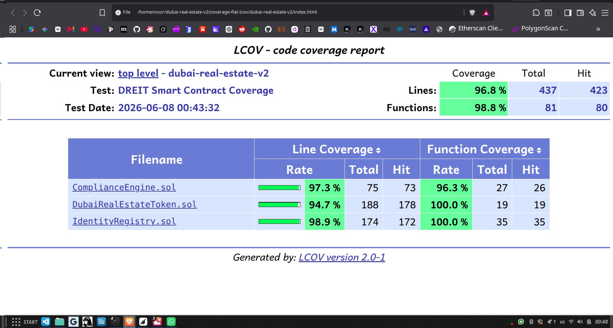
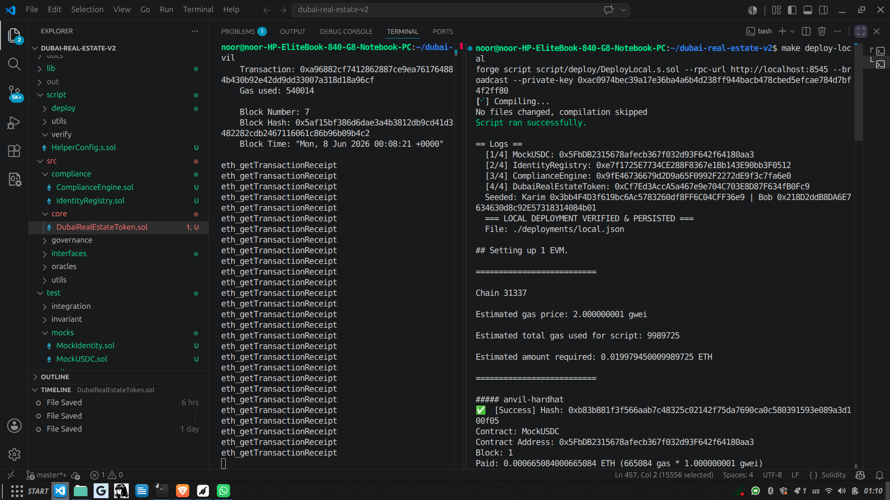
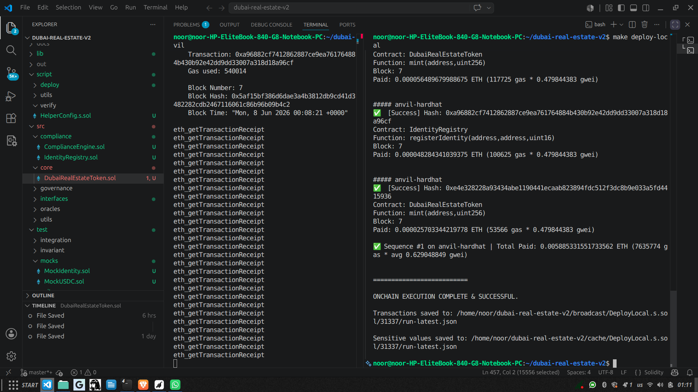
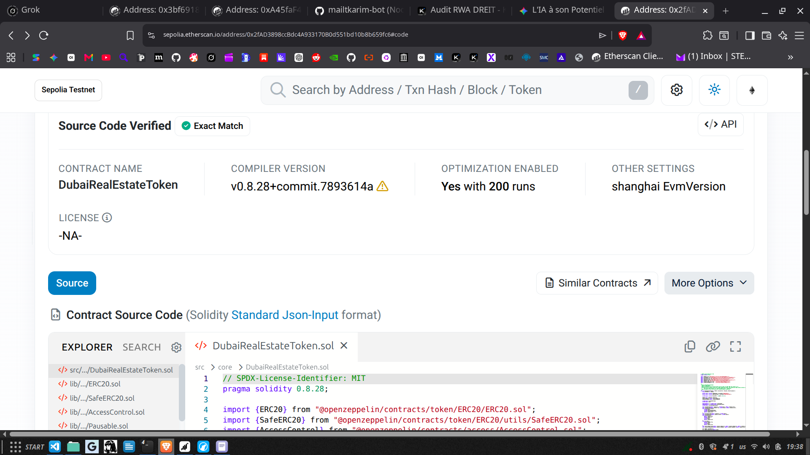
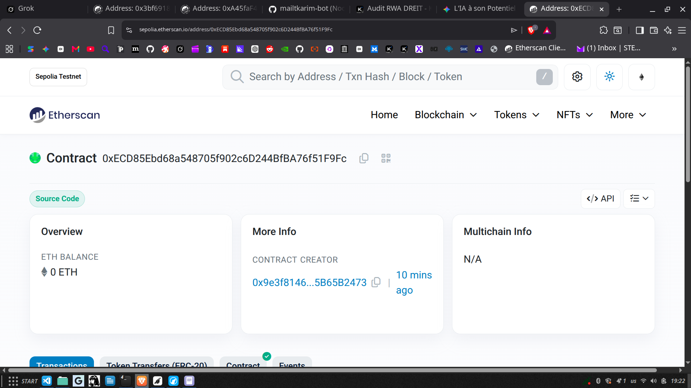
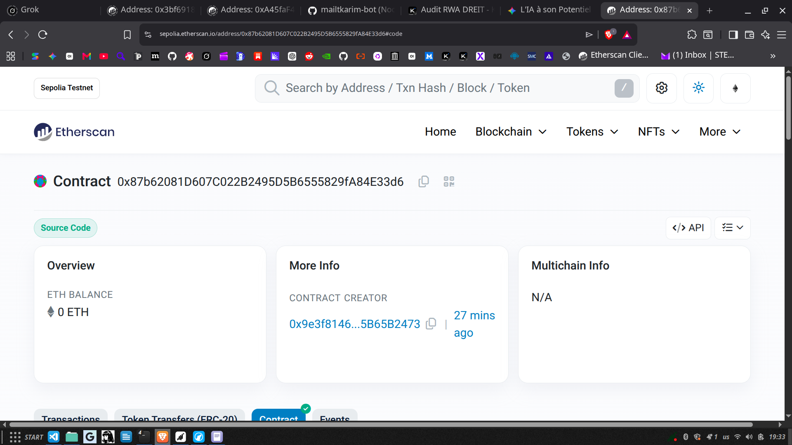
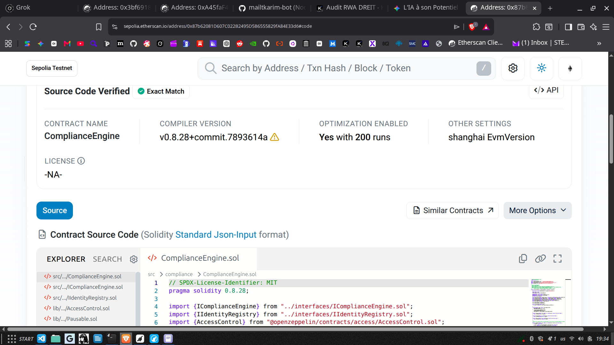

# Dubai Real Estate Investment Token (DREIT)

<div align="center">


[](https://mailtkarim-bot.github.io/dubai-real-estate-v2/)


**Educational RWA tokenization architecture inspired by ERC-3643 (T-REX).**  
Smart contract portfolio project demonstrating on-chain identity registry, automated compliance engine, dividend distribution, and Etherscan-verified Sepolia deployment.

> ⚠️ **Not production-ready.** No external security audit has been performed. For production RWA tokenization, consult a licensed entity and a Tier-1 audit firm.

<div align="center">

[](https://mailtkarim-bot.github.io/dubai-real-estate-v2/)

</div>

</div>

---

## Table of Contents

- [🌐 Live Frontend Demo](#-live-frontend-demo)
- [Vision](#vision)
- [Why ERC-3643?](#why-erc-3643)
- [Security & Compliance](#-security--compliance)
- [Technical Architecture](#-technical-architecture)
- [Test Results](#-test-results)
- [Coverage Report](#-coverage-report)
- [Deployment](#-deployment)
- [Sepolia Testnet](#-sepolia-testnet)
- [Tech Stack](#-tech-stack)
- [Key Features](#-key-features)
- [Pre-Production Checklist](#-pre-production-checklist)
- [Documented Risks](#-documented-risks)
- [Screenshots](#-screenshots)
- [Gas Report](#-gas-report)
- [License](#-license)
- [Contact](#-contact)

---

## Vision

Dubai Real Estate Investment Token (DREIT) democratizes access to premium Dubai real estate by tokenizing fractional ownership on the blockchain. Each token represents a regulated, KYC-verified share in a physical asset, with automatic rental yield distribution in stablecoins and programmable compliance enforced at the protocol level.

> **Why Dubai?** Regulated financial hub (DFSA / VARA), zero crypto capital gains tax, and accelerating institutional adoption of Real World Assets (RWA).

> **Why ERC-3643?** The T-REX standard is the institutional benchmark for permissioned security tokens. It enforces identity verification before any transfer, mint, or burn — making the token natively compliant with securities regulations.

---

## ⚠️ Regulatory Disclaimer

This project is **not licensed by VARA, DFSA, or any regulatory authority** in the UAE or elsewhere. It is intended for **educational and portfolio purposes only**.

- Do not use this code to tokenize real assets without legal counsel and a licensed entity.
- Do not offer tokenization, audit, or compliance services to third parties without appropriate licenses.
- The deployed Sepolia contracts are for demonstration only and should not hold real value.

---

## 🌐 Live Frontend Demo

A production-grade React interface is deployed on **GitHub Pages** and connected to the verified Sepolia testnet contracts.

<div align="center">

[](https://mailtkarim-bot.github.io/dubai-real-estate-v2/)

</div>

| Resource | Details |
|----------|---------|
| **Live DApp** | [https://mailtkarim-bot.github.io/dubai-real-estate-v2/](https://mailtkarim-bot.github.io/dubai-real-estate-v2/) |
| **Frontend Code** | [`frontend/`](./frontend) |
| **Network** | Sepolia Testnet (Chain ID: 11155111) |
| **Wallet** | MetaMask, Rainbow, Coinbase Wallet (via RainbowKit + wagmi) |
| **Pages** | Home, Investor Dashboard, Admin Panel |
| **Stack** | React 19, Vite 8, Tailwind CSS v4, wagmi/viem, RainbowKit, Recharts |

### Features

- **Connect Wallet** — multi-wallet support via RainbowKit
- **Investor Dashboard** — view token balance, KYC status, and claim USDC dividends
- **Admin Panel** — mint tokens, manage compliance, and distribute dividends
- **Real-Time Data** — reads directly from the verified Sepolia contracts
- **Responsive UI** — dark-mode-first design with Tailwind CSS v4

> ⚠️ **Demo only.** Connect with a Sepolia-funded test wallet. Do not send mainnet funds.

---

## Why ERC-3643?

Unlike standard ERC-20 tokens, DREIT implements the **T-REX (Token for Regulated Exchanges)** standard:

- **On-chain identity** — every holder must be KYC-verified in the `IdentityRegistry`
- **Transfer validation** — every transfer is pre-validated by the `ComplianceEngine`
- **Regulator controls** — freeze accounts, restrict jurisdictions, enforce holding limits
- **Permissioned mint/burn** — only authorized issuers can create or destroy tokens
- **Forced transfers/burns** — regulator-enforced actions with on-chain audit trail

This architecture is designed for **regulated primary issuance** and **secondary trading on permissioned exchanges**.

---

## 🔐 Security & Compliance

| Feature | Implementation | Status |
|---------|---------------|--------|
| **ERC-3643 Identity Registry** | Mandatory KYC/AML verification before any token interaction | ✅ Deployed & Verified |
| **Compliance Engine** | Pre/post transfer hooks with freeze lists, country restrictions, whitelists | ✅ Deployed & Verified |
| **Emergency Pause** | OpenZeppelin `Pausable` — instant freeze on incident detection | ✅ Tested |
| **Reentrancy Protection** | `ReentrancyGuard` on `mint`, `burn`, `claimDividends`, `distributeDividends` | ✅ Tested |
| **Role-Based Access Control** | OpenZeppelin `AccessControl` — separate DEFAULT_ADMIN, ISSUER, REGULATOR roles | ✅ Tested |
| **Anti-Retroactive Dividend Theft** | `lastClaimed` initialized for new holders — prevents draining past dividends | ✅ Tested |
| **Max Supply Guard** | Hard cap of 1 billion tokens with saturation fuzzing | ✅ Tested |
| **Batch Mint Limit** | Hard cap of 100 recipients per call — prevents DoS | ✅ Tested (Bug #5) |
| **Identity Balance Lock** | `deleteIdentity` rejected if `balanceOf > 0` | ✅ Tested (Bug #6) |
| **KYC Expiry Sanity Check** | Minimum 1-day expiry — prevents instant lockout | ✅ Tested (Bug #7) |
| **Compliance-Token Binding** | `compliance.bindToken()` enforced in deployment script | ✅ Tested (Bug #8) |

### Security Hardening (8 Critical Design Improvements)

During development, the following issues were identified and corrected in the codebase through internal review and adversarial testing:

| # | Vulnerability | Fix |
|---|---------------|-----|
| 1 | Freeze state stored in token (centralization / upgrade risk) | Delegated entirely to `ComplianceEngine` |
| 2 | `forcedTransfer` bypassed compliance checks | Added pre/post `isCompliant()` hooks |
| 3 | `burn` allowed without KYC validation | Added `verifyIdentity()` + expiry check |
| 4 | `claimDividends` bypassed KYC | Added `verifyIdentity()` + expiry check |
| 5 | `batchMint` unbounded (DoS / gas griefing) | Hard cap of 100 recipients |
| 6 | `deleteIdentity` permitted with token balance | Revert if `balanceOf > 0` |
| 7 | KYC expiry could be set to 0 (instant lockout) | Enforce minimum 1-day expiry |
| 8 | Compliance engine not linked to token at deployment | `compliance.bindToken(address(token))` in deploy script |

---

## 🏗️ Technical Architecture

```
dubai-real-estate-v2/
├── 📁 src/                                     # Solidity smart contracts
│   ├── core/
│   │   └── DubaiRealEstateToken.sol          # ERC-3643 T-REX token + dividends
│   ├── compliance/
│   │   ├── IdentityRegistry.sol              # KYC/AML on-chain registry
│   │   └── ComplianceEngine.sol              # Transfer rules & freeze logic
│   └── mocks/
│       └── MockUSDC.sol                      # Sepolia USDC mock for local tests
├── 📁 test/                                    # Foundry tests
│   ├── unit/                                 # Foundry unit tests
│   ├── integration/                          # End-to-end flows
│   └── fuzzing/                              # 8 fuzzing campaigns × 10k runs
├── 📁 script/deploy/                           # Deployment scripts
│   ├── DeployLocal.s.sol                     # Anvil local deployment
│   ├── DeployTestnet.s.sol                   # Sepolia deployment + verify
│   └── DeployMainnet.s.sol                   # Mainnet deployment template
├── 📁 frontend/                                # React + Vite + wagmi DApp
│   ├── src/                                  # Components, pages, ABIs, wagmi config
│   ├── public/                               # Static assets
│   ├── package.json
│   └── vite.config.ts
├── 📁 broadcast/                             # Deployment transactions
├── 📁 deployments/                           # Deployment metadata
│   ├── local.json
│   └── testnet.json                          # ← Sepolia addresses
├── 📁 docs/
│   ├── ARCHITECTURE.md                       # Full system design
│   └── screenshots/                          # Proof of deployment & tests
├── .env.example
├── foundry.toml
├── Makefile
├── LICENSE
└── README.md
```

### Transfer Flow (Buy / Sell / Transfer)

```
                    KYC-Verified Investor
                           │
                           ▼
              ┌─────────────────────────────┐
              │      IdentityRegistry       │
              │   (KYC/AML/Accreditation)   │
              └─────────────────────────────┘
                           │
                           │ verifyIdentity(to)
                           │ verifyIdentity(from)
                           ▼
              ┌─────────────────────────────┐
              │      ComplianceEngine       │
              │  (Freeze / Country / Pause) │
              └─────────────────────────────┘
                           │
                           │ isCompliant(from, to, amount)
                           ▼
              ┌─────────────────────────────┐
              │    DubaiRealEstateToken     │
              │      (ERC-3643 T-REX)       │
              └─────────────────────────────┘
                           │
           ┌───────────────┼───────────────┐
           ▼               ▼               ▼
    ┌─────────────┐ ┌─────────────┐ ┌─────────────┐
    │    Mint     │ │  Transfer   │ │    Burn     │
    │  (Issuer)   │ │  (Holder)   │ │ (Issuer/    │
    └─────────────┘ └─────────────┘ │  Regulator) │
                                    └─────────────┘
                           │
                           ▼
              ┌─────────────────────────────┐
              │    Dividend Distribution    │
              │   (Pull Model — O(1))       │
              └─────────────────────────────┘
```

Full architecture document: [`docs/ARCHITECTURE.md`](./docs/ARCHITECTURE.md)

---

## 📊 Test Results

```bash
$ make test

[⠊] Compiling...
No files changed, compilation skipped

╭------------------------------+--------+--------+---------╮
| Test Suite                   | Passed | Failed | Skipped |
+==========================================================+
| DubaiRealEstateTokenFuzzTest | 8      | 0      | 0       |
| DREITIntegrationTest         | 3      | 0      | 0       |
| ComplianceEngineTest         | 46     | 0      | 0       |
| DubaiRealEstateTokenTest     | 91     | 0      | 0       |
| IdentityRegistryTest         | 76     | 0      | 0       |
╰------------------------------+--------+--------+---------╯

Ran 5 test suites: 213 unit tests + 3 integration tests + 8 fuzzing tests passed, 0 failed, 0 skipped
```

### Fuzzing Campaign

```bash
$ forge test --match-contract DubaiRealEstateTokenFuzzTest

[PASS] testFuzz_BurnReducesTotalSupply(uint256,uint256) (runs: 10000, μ: 271083, ~: 273841)
[PASS] testFuzz_DividendDistributionIsConsistent(uint256,uint256,uint256) (runs: 10000, μ: 546729, ~: 547002)
[PASS] testFuzz_DividendSolvencyAfterMintAndDistribute(uint256,uint256,uint256) (runs: 10000, μ: 654170, ~: 654443)
[PASS] testFuzz_ForcedTransferRespectsComplianceFrom(uint256,uint256) (runs: 10000, μ: 584563, ~: 584724)
[PASS] testFuzz_FrozenAccountCannotTransfer(uint256,uint256) (runs: 10000, μ: 566985, ~: 567146)
[PASS] testFuzz_KYCExpiryLocksTransfers(uint256,uint256) (runs: 10000, μ: 569523, ~: 569684)
[PASS] testFuzz_MaxSupplyCannotBeExceeded(uint256,uint256) (runs: 10000, μ: 228292, ~: 228373)
[PASS] testFuzz_MintSyncsDividendsProportionally(uint256,uint256,uint256) (runs: 10000, μ: 533217, ~: 533490)

Suite result: ok. 8 passed; 0 failed; 0 skipped
```

---

## 📈 Coverage Report

Coverage excludes deployment scripts and test files. Core contract coverage:

| Contract | Lines | Statements | Branches | Functions |
|----------|-------|------------|----------|-----------|
| **ComplianceEngine.sol** | 97.33% | 98.59% | **100.00%** | 96.30% |
| **IdentityRegistry.sol** | 98.85% | 98.12% | 91.43% | **100.00%** |
| **DubaiRealEstateToken.sol** | 94.68% | 94.21% | 91.53% | **100.00%** |
| **Core Contracts Average** | **96.95%** | **96.97%** | **94.32%** | **98.77%** |

> Global coverage is 77.30% because Foundry includes deployment scripts (`script/`) at 0% coverage. Excluding scripts, the core tokenization and compliance logic is **>96% covered**.

---

## 🚀 Deployment

### Prerequisites

- [Foundry](https://book.getfoundry.sh/getting-started/installation) installed
- Wallet with test ETH (for Sepolia deployment)
- Etherscan API key (for contract verification)

### Installation & Local Deployment

```bash
# 1. Clone the repository
git clone https://github.com/TON_USER/dubai-real-estate-v2.git
cd dubai-real-estate-v2

# 2. Install Foundry dependencies
forge install

# 3. Compile
forge build

# 4. Test
make test

# 5. Start Anvil (in a new terminal)
make anvil

# 6. Deploy to local Anvil
make deploy-local
```

### Sepolia Deployment

```bash
# 1. Configure environment variables
cp .env.example .env
# Edit .env with your SEPOLIA_RPC_URL, PRIVATE_KEY, and ETHERSCAN_API_KEY

# 2. Dry run (zero ETH spent)
make deploy-sepolia-dry

# 3. Deploy + verify on Etherscan
make deploy-sepolia
```

---

## 🌐 Sepolia Testnet

Contracts deployed and verified on **Sepolia Testnet** (Ethereum test network).

| Contract | Address | Explorer |
|----------|---------|----------|
| **DubaiRealEstateToken (DREIT)** | `0x2fAD3898ccBdc4A933170B0d551bd10b8b659fc6` | [View on Etherscan](https://sepolia.etherscan.io/address/0x2fAD3898ccBdc4A933170B0d551bd10b8b659fc6) |
| **IdentityRegistry** | `0xECD85Ebd68a548705f902c6D244BfBA76f51F9Fc` | [View on Etherscan](https://sepolia.etherscan.io/address/0xECD85Ebd68a548705f902c6D244BfBA76f51F9Fc) |
| **ComplianceEngine** | `0x87b62081D607C022B2495D5B6555829fA84E33d6` | [View on Etherscan](https://sepolia.etherscan.io/address/0x87b62081D607C022B2495D5B6555829fA84E33d6) |

- **Network:** Sepolia Testnet (Chain ID: 11155111)
- **Deployer:** `0x9e3f8146d3FA4B37033e73BFC95728f5B65B2473`
- **Block:** 11016999
- **Date:** June 8, 2026
- **Gas Used:** 0.00625 ETH
- **Deployment artifact:** [`deployments/testnet.json`](./deployments/testnet.json)
- **Stablecoin:** Sepolia USDC `0x1c7D4B196Cb0C7B01d743Fbc6116a902379C7238`

### Sepolia Deployment Command

```bash
# Using the Makefile (recommended)
make deploy-sepolia

# Or manually with forge
forge script script/deploy/DeployTestnet.s.sol \
  --rpc-url $SEPOLIA_RPC_URL \
  --private-key $PRIVATE_KEY \
  --broadcast \
  --verify \
  --etherscan-api-key $ETHERSCAN_API_KEY
```

---

## 🛠️ Tech Stack

| Layer | Technology |
|-------|------------|
| **Smart Contract** | Solidity 0.8.28, OpenZeppelin Contracts v5 |
| **Frontend** | React 19, Vite 8, Tailwind CSS v4, wagmi/viem |
| **Standard** | ERC-3643 (T-REX), ERC-20 |
| **Testing** | Foundry (Forge + Cast), 213 unit tests, 8 fuzzing campaigns |
| **Coverage** | `forge coverage` + lcov HTML report |
| **CI/CD** | GitHub Actions ready |
| **Target Network** | Ethereum / Sepolia Testnet / Local Anvil |
| **Verification** | Etherscan API auto-verification |
| **Stablecoin** | USDC (6 decimals) on Sepolia |

---

## 🎯 Key Features

### 1. ERC-3643 T-REX Compliance
Full implementation of the Token for Regulated Exchanges standard — identity registry, compliance engine, and permissioned transfers.

### 2. On-Chain Identity Registry
KYC status, investor type, country of residence, and expiry are stored on-chain. Only verified wallets can hold or transfer DREIT.

### 3. Automated Compliance Engine
Every transfer is validated against:
- Freeze lists (regulator-enforced)
- Restricted countries (sanctions / jurisdictions)
- Whitelist mode (strict KYC enforcement)
- Pause state (emergency stop)

### 4. Permissioned Mint & Burn
Only addresses with `ISSUER_ROLE` can mint. Only the token contract or regulators can trigger burns. All actions enforce KYC.

### 5. Forced Transfer & Forced Burn
Regulators can enforce transfers or burns with an on-chain reason string — essential for legal orders, sanctions, or clawbacks.

### 6. Automatic Dividends (Pull Model O(1))
Rental income distributed in stablecoins. Each investor claims on their own schedule — no expensive loops, no wasted gas.

### 7. Batch Mint
Issue tokens to up to 100 investors in a single transaction — gas-efficient primary issuance.

### 8. Emergency Pause
OpenZeppelin `Pausable` freezes transfers, mints, burns, and claims. Unpause remains accessible to admins.

### 9. Dust Recovery
Undistributed dividend rounding remains are accumulated and recoverable by the admin — gas optimization without fund loss.

### 10. Role-Based Access Control
Three distinct roles (`DEFAULT_ADMIN_ROLE`, `ISSUER_ROLE`, `REGULATOR_ROLE`) prevent single-key compromise from taking full control.

---

## ✅ Pre-Production Checklist

| Step | Status | Notes |
|------|--------|-------|
| Unit tests | ✅ | 213/213 passed |
| Fuzzing tests | ✅ | 8 campaigns × 10,000 runs, 0 failures |
| Security bug fixes | ✅ | 8 security hardening improvements |
| Core contract coverage | ✅ | >96% lines, >94% branches |
| Sepolia testnet deployment | ✅ | June 8, 2026 — 3 contracts verified |
| Etherscan verification | ✅ | Auto-verified on deployment |
| NatSpec documentation | ✅ | All public/external functions documented |
| External audit | ⏳ | Trail of Bits / OpenZeppelin / CertiK |
| TimelockController | ⏳ | Replace direct admin before mainnet |
| Multisig (Gnosis Safe) | ⏳ | Owner = Safe with 3/5 signers |
| Frontend integration | ✅ | DApp React + wallet connect (GitHub Pages) |
| Legal compliance | ⏳ | VARA / DFSA regulatory consultation |

---

## ⚠️ Documented Risks

| Risk | Description | Mitigation |
|------|-------------|------------|
| **Admin Centralization** | Admin can pause, mint, freeze, and upgrade registries | Timelock + Gnosis Safe before mainnet; role separation already implemented |
| **KYC Oracle Dependency** | Identity verification relies on off-chain issuers | Multiple trusted issuers registry; expiry enforcement on-chain |
| **Stablecoin Dependency** | Dividends use USDC (6 decimals) | Explicit decimal handling; adapter ready for DAI if needed |
| **Illiquidity** | No integrated secondary market | Documented — to implement via permissioned DEX or centralized order book |
| **Regulatory Change** | Dubai / UAE regulations may evolve | Modular compliance engine allows rule updates without token redeployment |
| **Undiscovered Bug** | No external audit has been performed | Mandatory audit before mainnet; 213 unit tests + 8 fuzzing campaigns as first line |

---

## 📸 Screenshots

### Foundry Test Suite — 213/213 Passed


### Fuzzing Campaign — 8/8 × 10,000 Runs


### Coverage Report — Core Contracts >96%


---

### 🌐 Sepolia Deployment — Terminal Output


### 🌐 Sepolia Deployment — Address Artifact


---

### 🖥️ Local Deployment — Anvil (Offline Testing)

<p align="center">
  
  
</p>

### 🖥️ Local Deployment — Address Artifact


---

### 🌐 Etherscan — DREIT Token Contract
<p align="center">
  
  
</p>

### 🌐 Etherscan — Identity Registry
<p align="center">
  
  
</p>

### 🌐 Etherscan — Compliance Engine
<p align="center">
  
  
</p>

---

### Contract Architecture

#### DubaiRealEstateToken

- **Standards**: `ERC-20` + `AccessControl` + `Pausable` + `ReentrancyGuard`
- **Roles**: `DEFAULT_ADMIN_ROLE`, `ISSUER_ROLE`, `REGULATOR_ROLE`
- **Key State**: `stablecoin`, `identityRegistry`, `complianceEngine`, `dividendPerToken`, `pendingDividends`, `lastClaimed`
- **Events**: `TokensMinted`, `TokensBurned`, `ForcedTransfer`, `ForcedBurn`, `DividendsDistributed`, `DividendClaimed`, `DividendSynced`

#### IdentityRegistry

- **Role**: `DEFAULT_ADMIN_ROLE` (agent management), `AGENT_ROLE` (identity operations)
- **Key State**: investor → identity mapping, KYC expiry, country, investor type
- **Events**: `IdentityRegistered`, `IdentityDeleted`, `IdentityUpdated`, `CountryUpdated`, `InvestorTypeUpdated`, `KYCExpiryUpdated`

#### ComplianceEngine

- **Role**: `DEFAULT_ADMIN_ROLE`, `REGULATOR_ROLE`
- **Key State**: bound token, frozen investors, restricted countries, whitelist mode
- **Events**: `InvestorFrozen`, `InvestorUnfrozen`, `CountryRestricted`, `CountryUnrestricted`, `TokenBound`, `TokenUnbound`

---

## ⛽ Gas Report

Approximate gas costs for main user flows (measured on Sepolia-equivalent EVM):

| Function | Gas (approx) | Actor |
|----------|-------------|-------|
| `mint` | ~215,000 | Issuer |
| `batchMint` (1 recipient) | ~166,000 | Issuer |
| `burn` | ~348,000 | Holder / Regulator |
| `transfer` | ~187,000 | Holder |
| `forcedTransfer` | ~210,000 | Regulator |
| `forcedBurn` | ~347,000 | Regulator |
| `distributeDividends` | ~255,000 | Admin |
| `claimDividends` | ~52,000 | Holder |
| `registerIdentity` | ~119,000 | Agent |
| `freezeInvestor` / `unfreezeInvestor` | ~44,000 | Regulator |
| `pause` / `unpause` | ~30,000 | Admin |

Deployment costs (Sepolia, 200 optimizer runs):
- **IdentityRegistry:** ~2,116,598 gas
- **ComplianceEngine:** ~1,204,707 gas
- **DubaiRealEstateToken:** ~2,874,531 gas
- **Total:** ~6,247,104 gas (~0.00625 ETH at 1 gwei)

---

## 📜 License

MIT License — Free use for educational and commercial projects subject to pre-production audit.

See [LICENSE](./LICENSE) for the full text.

---

## 👤 About the Author

**Noor Rayan** — Solidity Developer exploring RWA tokenization and on-chain compliance.

This project is a personal portfolio for educational and learning purposes. I am not a licensed financial advisor, security auditor, or VARA-registered entity. For production RWA tokenization, consult licensed professionals and a Tier-1 audit firm.

- 🐙 **GitHub**: [@mailtkarim-bot](https://github.com/mailtkarim-bot)
- ✉️ **Email**: STEP_RAYAN@protonmail.com

Open to **junior developer roles**, **freelance smart contract projects**, and **collaboration** on ERC-3643 / security token implementations.

---

<p align="center">
  <i>"Tokenize the tangible. Verify the invisible."</i>
</p>

<p align="center">
  ⭐ Star this repo if this project inspires you — forks and contributions are welcome.
</p>
